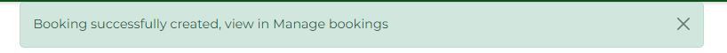
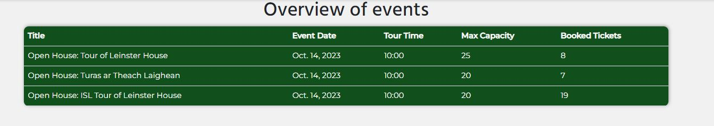

# Oireachtas Events

## Project overview

Project for Code Institute Full-stack development program: Full-Stack Toolkit.

 

View the [Live site](https://oir-events.herokuapp.com/)

### Project goals

The Houses of the Oireachtas (Irish Parliament) regularly hosts events and exhibitions, and also offers the public an opportunity to visit Leinster House for a tour of the historic building. The Oireachtas Events site seeks to provide a single booking system for tickets to all Oireachtas events and tours.

The site will offer users information on all Oireachtas events, exhibitions and open tours, an ability to create an account to book and cancel tickets, and will also provide important visit information. The site will allow the site owner to manage ticketing for all events through one site.

## Table of Contents

1. [User Experience](#user-experience)
    1. [Target Audience](#target-audience)
    2. [User Requirements and Expectations](#user-requirements-and-expectations)
2. [Planning](#planning)
    1. [Agile Planning](#agile-planning)
    2. [User stories](#user-stories)
3. [Design](#design)
    1. [Colour Scheme](#colour-scheme)
    2. [Typography](#typography)
	3. [Structure](#the-structure)
		1. [Website pages](#website-pages)
		2. [Database](#database)
		3. [Wireframes](#wireframes)		
4. [Features](#features)
    1. [Navigation Menu](#navigation-menu)
    2. [Footer](#footer)
	3. [Homepage](#homepage)
    4. [Events pages](#events-pages)
	5. [Booking pages](#booking-pages)
	6. [Contact Us](#contact-us)
	7. [Error Pages](#error-pages)
	8. [Favicon](#favicon)
    9. [Toast messages](#toast-messages)
5. [Future Features](#future-features)
6. [Testing](#testing)
7. [Security Features and Defensive Design](#security-features-and-defensive-design)
8. [Technologies Used](#technologies-used)
	1. [Languages](#languages)
    2. [Main Python Modules](#main-python-modules)
	3. [Other](#other)
9. [Deployment](#deployment)
10. [Credits](#credits)

## User Experience

### Target Audience 

* Members of the public who would like more information on Oireachtas events 
* Members of the public who would like to attend Oireachtas events 
* Members of the public who would like to delete bookings for Oireachtas events 

### User Requirements and Expectations 

* A visually appealing, accessible, and easy to use site 
* An intuitive navigation with logical workflows for event booking management 
* An ability to view information on events and manage bookings

##### Back to [top](#table-of-contents)

## Planning

### Agile Planning

This project was developed using agile methodologies by delivering features in sprints. There were 3 sprints in total, the work was carried out over four weeks.

Initially user stories were developed, and a full set of acceptance criteria was created in order to define the functionality of the required feature. These user stories were assigned to epics (milestones) and prioritised under the labels, *Must have*, *Should have*, and *Could have*. Then they were assigned to sprints and story pointed, according to complexity. *Must have* user stories were completed first, followed by *should haves* and then finally *could haves*. This approach was taken to ensure that all core requirements were completed first, with the nice to have features being added should there be capacity. 

In GitHub projects, a Kanban board was used to track the progress of the project, the workflow started with *To do* then *In Progress*, *Done* and finally *Closed*. 

 

* View the [Kanban board](https://github.com/users/michelleconville/projects/5)

### User stories
(Broken down by Epic)

EPIC 1 - Initial Setup

* As a developer, I need to set up the project so that it is ready for implementing the core features
* As a developer, I need to create static resources so that images and CSS work on the website
* As a developer, I need to create the navbar so that users can navigate the website
* As a developer I need to create the footer with social media links so this information can be found on any page on the website
* As a developer, I need to create the base.html page and structure so that other pages can reuse the layout

EPIC 2 - Authentication Epic 

* As a developer, I need to implement allauth so that users can sign up and have access to the website’s features
* As a site owner, I would like the allauth pages customized to that they fit in with the sites styling 
* As a site owner, I want users to verify their email when registering an account so that I can ensure that a valid email address is being used. 

EPIC 3 – Events 

* As a staff member, I want to create events so I can allow bookings
* As a staff member, I want to be able to delete events if they are no longer going ahead
* As a staff member, I want to be able to edit events 
* As a site user, I want to be able to find information on all Oireachtas tours so that I can decide if I want to book tickets 

Epic 4 – Bookings

* As a site user, I want to be able to book tickets for all available events so that I can attend
* As a staff member, I want to be able to edit the bookings for events so that I can change the number of tickets booked
* As a site user, I want to be able to cancel bookings for events so that I can confirm I am no longer available
* As a site user, I want to receive a confirmation for event bookings so that I have a record of the bookings I made 
* As a staff member, I want to view details of booking so I can manage the attendance of events

Epic 5 Additional pages

* As a developer, I need to implement a 404-error page to alert users when they have accessed a page that doesn't exist
* As a developer, I need to implement a 500-error page to alert users when an internal server error occurs
* As a developer, I need to implement a 403-error page to redirect unauthorised users to, so that I can secure my views
* As a site owner, I would like a home page so that users can view information on my website
* As a site user, I want to read frequently asked questions so that I can find information on events
* As a site user, I want to access information on how to find Leinster House, so I arrive at the correct entrance
* As a user, I would like to be able to contact the events team so that I can have any queries answered

EPIC 6 - Deployment Epic

* As a developer, I need to deploy the project to Heroku so that it is live for users

EPIC 7 – Documentation

* Complete readme documentation 

##### Back to [top](#table-of-contents)

## Design 

### Colour Scheme

 

The colour palette selected for the site complements the palette of the Houses of the Oireachtas. The dark green is the main colour on the website and the background pages are a light grey. The pink colour is mainly used in the navigation bar and on the detailed events page to break it up. Both the black and white colours are used for text throughout the site.  

### Typography

The fonts used are Montserrat and Hind. Fonts were imported from Google Fonts. The backup font of sans-serif was used in case the fonts do not load for the user.

### The structure

#### Website pages

The site was designed to be user-friendly and responsive, with the navigation bar along the top of the pages and a hamburger menu button for smaller screen.

The footer contains the social media links for the Houses of the Oireachtas so the user can visit any social media platforms and follow, which will help to expand the followers, likes and shares.

The site consists of the following pages:

* A homepage with a carrousel of images and call to action buttons on the images, it also contains an accordion of Visitor Information.
* An events page with cards of all the upcoming events.
* An Add event form to create new events 
* A detailed event page that gives all the information about a particular event, staff have the option to edit or delete the event from this page
* A create booking form, to book tickets for any upcoming events
* A manage booking page, users will have the option to delete there booking from here which will then delete it from the database, staff will also have this option and the option to edit the booking. 
* A booking overview, that displays number of tickets booked per event for staff only
* A contact form that allows both login and not logged in users to send a message
* Login / Logout allows users to login to make bookings, view, and delete bookings
* Register allows the user to register so they can use the booking system
* Error pages – 404, 403, 500

#### Database

The database was designed to allow CRUD functionality to be available to registered users, when signed in. The user model is at the center of the application as it connects the Events and Bookings, linked by primary/foreign key relationships. Additionally, the contact model was designed to allow non logged in users interact with the website.

An entity relationship diagram was created and shows the schemas for each of the models and how they are related.

 

#### Wireframes

Homepage

 

Events pages

 

Booking pages

 

Contact pages

 

Authentication pages

 

Error messages

 

##### Back to [top](#table-of-contents)

## Features

### Navigation Menu

*       USER STORY: As a developer, I need to create the navbar so that users can navigate the website

 

The initial navigation menu contain links to the Home, Events, Contact, Register, Login pages. The navigation menu is displayed on all pages and changes into a hamburger menu on smaller devices. This will allow users to view the site from any device.

The navigation changes depending on whether the user is an end user or a staff user. 

If an end user chooses to register and/or login, the following navigation options are available:

* Home 
* Events -> detailed event page
* Bookings (Drop Down):
    * Manage Bookings (user booking only)
    * New Booking
* Contact
* Logout

If a staff user chooses to register and/or login, the following navigation options are available:

* Home 
* Events -> detailed event page
* Add (to add an event)
* Bookings (Drop Down):
    * Manage Bookings (All booking)
    * Booking overview
    * New Booking
* Contact
* Logout

### Footer 

*       USER STORY: As a developer I need to create the footer with social media links so this information can be found on any page on the website

 

A footer has been added to the bottom of the site, this contains social media links to Twitter, Facebook, YouTube, and LinkedIn so that users can follow the Oireachtas on our social media channels, so they can find our more about upcoming events and the work of the Houses of the Oireachtas if that interests them. 

These icons have aria-labels added to ensure users with assistive screen reading technology know what the purpose of the links are for. They also open in new tabs as they lead users away from the site.

### Homepage

*       USER STORY: As a site owner, I would like a home page so that users can view information on my website
*       USER STORY: As a site user, I want to read frequently asked questions so that I can find information on events
*       USER STORY: As a site user, I want to access information on how to find Leinster House, so I arrive at the correct entrance

 

The home page contains a carrousel of images taken in Leinster House. These images will have a call-to-action button on them, to either book an event or view all events. These buttons give the user a quick way to get to the events page or the booking page. 

The carrousel images can be added to or replaced at any time using the backend admin panel.

 

The second part of the home page is visitor information, this information is displayed in an accordion module. This will give users information on, where to find Leinster House and what gate to use, via both a text description and a map, the items that them will need to bring with them and how to book tickets if it is there first visit to the website. 

### Events pages

*       USER STORY: As a site user, I want to be able to find information on all Oireachtas tours so that I can decide if I want to book tickets

#### Events pages (List view of all events)

 

The events page contains a list of upcoming events that taking place in Leinster House, the events are displayed on cards, have an image, the name of the event and the short description, event card is clickable and will take the user to the detailed event page.

If there are no events currently scheduled to take place a message will display for the user to notify them of that. 

#### Event page (Detailed event page)

 

Each event has its own page, that contains three sections, the first has an image relating to the event, the event title, the date, the tour time, a short description and a book now button.  The second section is About this event, this gives more information about the upcoming event and the third is the What else to know section, this redirection the user to the visitor information.  

The first and second sections are unique to the event itself, this information will help the user decide if they would like to attend the event and give them the option to book a ticket. The third section is a quick way for the user to find the visitor information. 

#### Create event page

*       USER STORY - As a staff member, I want to create events so I can allow bookings

 

A create event page was implemented to allow staff users to create new events via the UI without having to use the backend admin panel. For staff and admin users only, a button “Add” will display in the navigation menu.

This will allow staff the ability to create an event and publish it to the website from a single page, this will create the Event page and will display an event card on the Events page. 

#### Edit event page

*       USER STORY - As a staff member, I want to be able to edit events

 

On the event page, an edit button displays for staff and admin users only, this allows staff to easily edit any of the details or make the page inactive if they no longer want to display to the website, this will not delete the event. 

#### Delete event page

*       USER STORY - As a staff member, I want to be able to delete events if they are no longer going ahead or are over

 

On the event page, a delete button displays for staff and admin users only, this allows staff to delete an event, once the button is selected, they will be taken to a confirmation page to confirm that they do want to delete the event. 

### Booking pages

#### Booking tickets

*       USER STORY: As a site user, I want to be able to book tickets for all available events so that I can attend

 

A booking page was created with a form that allows users to select the event that they would like to attend and the number of tickets they require for the event. Each user can book a maximum of 4 tickets per booking.

Logic was added to the form validation to ensure the user does not book more than 4 tickets per booking and also there is enough tickets left to book, as there is a max capacity for each event.

#### Notification of booking

*       USER STORY: As a site user, I want to receive a conformation for event bookings so that I know the booking was completed successfully

 

 

Custom toast messages were implemented on the successful creation of bookings. This provides feedback to the user, to confirm the booking was successfully received.

#### Manage bookings

*       USER STORY: As a staff member, I want to view details of booking so I can manage the attendance of events

 

For users, a manage bookings page was create with validation checks on the user. This shows all of the users’ bookings. This will allow the user to view their upcoming bookings when needed. The user has the option to delete there booking from this page also. 

If the user has not booked any tickets, a message "You have not booked any tickets" will appear on the manage booking page.

 

For staff users, all bookings will be available in the managed booking view so that staff can easily view all tickets booked. Staff have the option to both delete and edit a users booking from this screen.

#### Booking Overview

*       USER STORY: As a staff member, I want to view details of booking so I can manage the attendance of events

For staff, a booking overview was created, this will allow a snapshot of the number of tickets booked per event. For each event, Event date, the tour time, the maximum capacity on a tour and the number of tickets currently booked will be available, so that staff can quickly see the infomation.

 

#### Delete Bookings

*       USER STORY: As a site user, I want to be able to cancel bookings for events so that I can confirm I am no longer available

 

A delete button was added to the manage bookings page that will allow users to delete their booking should they no longer require, once the button is selected, they will be taken to a confirmation page to confirm that they do want to delete the booking. 

For staff members, they also have the ability to delete any booking through the UI as well. This will allow staff to free up tickets should a user contact the staff member directly.

#### Edit Booking

*       USER STORY: As a staff member, I want to be able to edit the bookings for events so that I can change the number of tickets booked

 

On the manage bookings page, an edit button displays for staff and admin users only, this allows staff to easily edit any booking to change the number of tickets that have been booked.

#### Contact Us

*       USER STORY: As a user, I would like to be able to contact the events team so that I can have any queries answered

 

A contact form was implemented for users of the site so they could contact the events team. The form can be user by both non-logged in and logged in users. This will allow the user to provide feedback or ask any questions.

 

On successful completion of the form the user will be re-directed to a success message and receive email confirmation. This will allow the user to know their message has been received. 

### Error Pages

#### 404 page

*   USER STORY - As a developer, I need to implement a 404-error page to alert users when they have accessed a page that doesn't exist

 

A 404 page has been implemented and will display if a user navigates to a broken link.

The 404 page will allow the user to easily navigate back to the main website if they direct to a broken link / missing page, without the need of the browsers back button.

#### 403 page

*   As a developer, I need to implement a 403-error page to redirect unauthorised users to, so that I can secure my views

 

A 403 error page has been implemented to provide feedback to the user when they try to access unauthorised content. 

Users will be directed to this page if they alter the URL's and attempt to edit, delete or access pages that are restricted.

#### 500 page

*   As a developer, I need to implement a 500-error page to alert users when an internal server error occurs

 

A 500 error page has been displayed to alert users when an internal server error occurs. 

The message outlines to users that the problem is with the website not anything they have done.

### Favicon

 

A site wide favicon was implemented. This provides an image in the tabs header to allow the user to easily identify the website if they have multiple tabs open.

### Toast messages

Custom toast messages were implemented throughout the site, initially created for [notification of bookings](#notification-of-booking). These also now provide the user feedback when they have logged in or logged out. 

For staff users, they have been implemented in the events section, when an event is created, edited or deleted. The toast messages are informative and have a lifespan of just two seconds and take up a very small portion of the screen.

##### Back to [top](#table-of-contents)

## Future Features 

### Search function for staff

It would be nice to include a search function for staff on the manage bookings page.

### QR codes for tickets

Adding a generate QR code function that emails to users as their ticket for an event.

## Testing 

Due to the amount of information regarding testing, it has been detailed in the following [Test document](https://github.com/michelleconville/oir_events/blob/main/TESTING.md).

##### Back to [top](#table-of-contents)

## Security Features and Defensive Design

For user authentication, Django's allauth was used for login and sign up functionality.

Views were secured by using the Django class-based view mixin, UserPassesTextMixin. A test function was created to use the mixin and checks were run to ensure that the user who is trying to access the page is authorised, the 403-page displays if this is the case. All staff restricted functionality; user edit/delete functionality listed in the features was secured using this method.

Environment variables are stored in an env.py for security purposes to ensure no secret keys, api keys or sensitive information was added the repository. In production, these variables were added to the Heroku config vars within the project.

Cross-Site Request Forgery (CSFR) tokens are used on all forms throughout the project.

##### Back to [top](#table-of-contents)

## Technologies Used
### Languages
*   HTML - The structure of the Website was developed using HTML as the main language.
*   CSS - The Website was styled using custom CSS in an external file.
*   JavaScript - This was used to make the message automaticly close
*   Python - The main programming language used for the application using the Django Framework.

### Main Python Modules

*   Django Class based views (ListView, UpdateView, DeleteView, CreateView) - Used to create, read, update and delete
*   Mixins (LoginRequiredMixin, UserPassesTestMixin) - Used to enforce login required on views and restrict users to the tasks that they could proform
*   Messages - Used to display feedback to users
*   CKEditor - Used for rich text editor on the Event pages
*   All External Python Modules are in the requirements.txt file

### Other

*   GitHub - Source code is hosted on GitHub.
*   Gitpod - Used to commit and push code during the development of the project.
*   ElephantSQL - used to manage a PostgreSQL database.
*   Heroku - To the deploy the code to a online terminal
*   Favicon.io - favicon files were created at https://favicon.io/favicon-converter/
*   balsamiq - wireframes were created using balsamiq
*   Bootstrap - Used to quickly add design to my website
*   Cloudinary - Used to store images online for the Events
*   Coolors - to make color palette
*   Am I Responsive - to create an image of the website shown on different devices.
*   Boxicons - to create the icons for social media
*   Lucidchart used to make a database diagram.

##### Back to [top](#table-of-contents)

## Deployment
The site was deployed via [Heroku]( https://id.heroku.com/login), and the live link can be found here: [Oireachtas Events website](https://oir-events.herokuapp.com/) 

### Github

This project was developed utilising the [Code Institute Template]( https://github.com/Code-Institute-Org/python-essentials-template). Some of the deployment steps below are specifically required for the new CI template and may not be applicable to older versions, or different projects.

Gitpod was used to write the code and push the code to repository created in github.

The git commands I used to push the code from gitpod to github were

`git add .` - This command was used to add the file(s) to the staging area before they are committed.

`git commit -m “commit message”` - This command was used to commit changes to the local repository queue ready for the final step.

`git push` - This command was used to push all committed code to the remote repository on github.

### Clone the repository
The steps to clone a repository are as follows:
1.	Navigate to the GitHub repository you would like to clone
2.	Click on the code drop down button
3.	Select if you prefere to clone using HTTPS, SSH, or Github CLI 
4.	Copy the repository link to the clipboard
5.	Open Git Bash
6.	Change the current working directory to the one where you want the cloned directory
7.	Type git clone and then paste the URL from the clipboard 
8.	Press Enter to create your local clone.

The repository will now be cloned on your local machine for use.

### Fork Repository
To fork the repository by following these steps:
1. Go to the GitHub repository
2. Click on Fork button in upper right hand corner

### Heroku
Before deploying to Heroku `pip3 freeze > requirements.txt` was used to add the neccessary installs for deployment and a Procfile was created.

#### Setting up a new app
1. Log in to [Heroku]( https://id.heroku.com/login) 
2. Click the button labelled **New** from the dashboard in the top right corner and from the drop-down menu select **Create New App**.
3. A unique app name must be used.
4. Next, select your region, (I chose Europe as I am in Ireland).
5. Click on the **Create App** button.

#### Updating the settings 
* Click on the **Settings Tab** 
* Scroll down to **Config Vars**
* Add the following config vars:
    * SECRET_KEY: (Your secret key)
    * DATABASE_URL: (Your database url)
    * EMAIL_HOST_USER: (email address)
    * EMAIL_HOST_PASS: (email app password)
    * CLOUNDINARY_URL: (cloudinary api url)

#### Deploying the application
* Scroll to the top of the page and now choose the **Deploy** tab.
* Select **Github** as the deployment method.
* Confirm you want to connect to GitHub.
* Search for the repository name and click the connect button.

Scroll to the bottom of the deploy page and select preferred deployment type:
* Click either **Enable Automatic Deploys** for automatic deployment when you push updates to Github.
* Select the correct branch for deployment from the drop-down menu and click **Deploy Branch** for manual deployment.

##### Back to [top](#table-of-contents)

## Credits
Media
* All images were provided and used from the [Oireachtas Flickr account](https://www.flickr.com/photos/oireachtas/)
* Content used on the Visitor Information area and Event pages was used from the [Houses of the Oireachtas website](https://www.oireachtas.ie/)
* Logo used is the Official Logo for the Houses of the [Houses of the Oireachtas](https://www.oireachtas.ie/)

Other
*   [RIS SMOK](https://github.com/Iris-Smok/The-Healthy-Family-PP4/blob/main/README.md)
*   [Gareth McGirr](https://github.com/Gareth-McGirr/Portfolio-Project-4-SizzleAndSteak/blob/main/README.md)

##  Acknowledgements
Special thanks to my mentor Daisy for her assistance throughout this project.

##### Back to [top](#table-of-contents)
