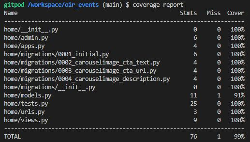
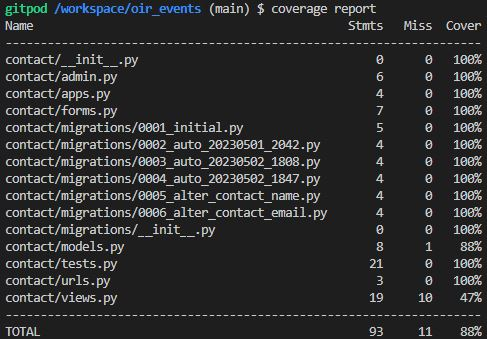
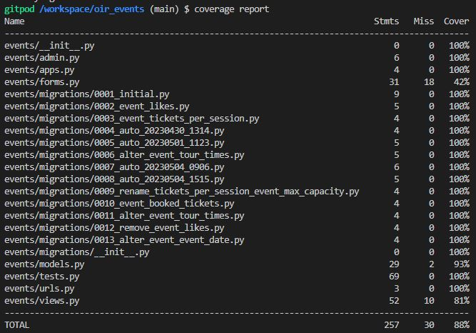
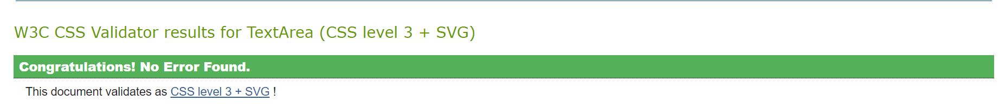

# Testing and Validation

I took a multi-stage approach to testing the site.

The first stage was continuous testing as the site was being developed. This was important to do during development of the django apps to ensure that the different models, views and forms contained or returned the correct data type or values. During the styling of the site, I checked the visual appearance within a live server window to preview the changes before they were committed to reduce the number of bugs.

For the second stage of testing, I used a more structured approach, I created both manual and automated test cases, using the user stories to ensure all the features worked as expected, I executed the tests individually making a note of any errors or changes to the designed behaviour. Any errors were corrected and then the tests repeated.

I then validated all the different types of code and ran performance and accessibility test across different browsers and device types.

Finally, I asked friends to look at the site on their devices and report any issues they came found. All issues reported have been resolved. 

## Table of Contents 
 - [Manual Testing](#manual-testing)
 - [Automated testing](#automated-testing)
 - [Validator Testing](#validator-testing)
 - [Testing Browser Compatibility](#testing-browser-compatibility)
 - [Bugs](#bugs)

## Manual Testing

* USER STORY: As a developer, I need to create the navbar so that users can navigate the website

**Non Logged in user**

**Step** | **Expected Result** | **Actual Result**
------------ | ------------ | ------------ |
| On any page click on the Home link in the Navigation bar | Homepage will load| Works as expected |
| On any page click on the Events link in the Navigation bar | Events page will load| Works as expected |
| On any page click on the Contact link in the Navigation bar | Contact us page will load| Works as expected |
| On any page click on the 'Register' link in the navigation bar | Sign up page will load| Works as expected |
| On any page click on the 'Login' link in the navigation bar | Login page will load| Works as expected |
| On any page click on the 'Logo' in the navigation bar | Homepage will load| Works as expected |

**Additional features for end user logged in**

**Step** | **Expected Result** | **Actual Result**
------------ | ------------ | ------------ |
| On any page click on the Bookings link in the navigation bar, select New Booking | Booking page will load| Works as expected |
| On any page click on the Bookings link in the navigation bar, select Manage Bookings | Manage bookings page will load| Works as expected |
| On any page click on the Logout link in the navigation bar | Logout page will load| Works as expected |

**Additional features for staff logged in**

**Step** | **Expected Result** | **Actual Result**
------------ | ------------ | ------------ |
| On any page click on the Add Event link in the navigation bar | Add event page will load| Works as expected |
| On any page click on the Bookings link in the navigation bar, select Booking Overview | Booking Overview page will load| Works as expected |
| On any page click on the Bookings link in the navigation bar, select New Booking | Booking page will load| Works as expected |
| On any page click on the Bookings link in the navigation bar, select Manage Bookings | Manage bookings page will load| Works as expected |
| On any page click on the Logout link in the navigation bar | Logout page will load| Works as expected |

* USER STORY: As a developer I need to create the footer with social media links so this information can be found on any page on the website

**Step** | **Expected Result** | **Actual Result**
------------ | ------------ | ------------ |
| On any page, navigate to the footer, click on the Facebook icon  | Facebook opened in a new tab in users’ browser  | Works as expected |
| On any page, navigate to the footer, click on the Instagram icon | Instagram opened in a new tab in users’ browser | Works as expected |
| On any page, navigate to the footer, click on the YouTube icon   | YouTube opened in a new tab in users’ browser   | Works as expected |
| On any page, navigate to the footer, click on the Twitter icon   | Twitter opened in a new tab in users’ browser   | Works as expected |

* USER STORY: As a site user, I want to read frequently asked questions so that I can find information on events

**Step** | **Expected Result** | **Actual Result**
------------ | ------------ | ------------ |
| On the homepage, scroll to Visitor Information | Find Visitor Information on the homepage  | Works as expected |

* USER STORY: As a site user, I want to access information on how to find Leinster House, so I arrive at the correct entrance

**Step** | **Expected Result** | **Actual Result**
------------ | ------------ | ------------ |
| On the homepage, scroll to Visitor Information, click on *where to find us* | Visitor information will display | Works as expected |

* USER STORY: As a site user, I want to be able to find information on all Oireachtas tours so that I can decide if I want to book tickets

**Step** | **Expected Result** | **Actual Result**
------------ | ------------ | ------------ |
| On any page click on the Events link in the Navigation bar | Events page will load| Works as expected |
| On any page click on the Events link in the Navigation bar, select an *event* card | Event page will load| Works as expected |
| On the homepage, in the carrousel, click on *View events* button | Events page will load| Works as expected |

* USER STORY - As a staff member, I want to create events so I can allow bookings

**Step** | **Expected Result** | **Actual Result**
------------ | ------------ | ------------ |
| On any page click on the Add Event link in the navigation bar | Add event page will load| Works as expected |

* USER STORY - As a staff member, I want to be able to edit events

**Step** | **Expected Result** | **Actual Result**
------------ | ------------ | ------------ |
| On any page click on the Events link in the Navigation bar, select an *event* card, select *edit* button | Event edit will load| Works as expected |
| On the homepage, in the carrousel, click on *View events* button, select an *event* card, select *edit* button | Event edit will load| Works as expected |

* USER STORY - As a staff member, I want to be able to delete events if they are no longer going ahead or are over

**Step** | **Expected Result** | **Actual Result**
------------ | ------------ | ------------ |
| On any page click on the Events link in the Navigation bar, select an *event* card, select *delete* button | Event delete button will load| Works as expected |
| On the homepage, in the carrousel, click on *View events* button, select an *event* card, select *delete* button | Event delete button will load| Works as expected |
| Select *delete* button on Event page | Deletion confirmation page will load| Works as expected |

* USER STORY: As a site user, I want to be able to book tickets for all available events so that I can attend

**Step** | **Expected Result** | **Actual Result**
------------ | ------------ | ------------ |
| On any page click on the Bookings link in the navigation bar, select New Booking | Booking page will load| Works as expected |
| On the homepage, in the carrousel, click on *Book now* button | Booking page will load| Works as expected |

* USER STORY: As a site user, I want to receive a conformation for event bookings so that I know the booking was completed successfully

**Step** | **Expected Result** | **Actual Result**
------------ | ------------ | ------------ |
| On *New Booking* page, choose an event, number of ticket and select *Create booking* button  | Toast message will appear | Works as expected |

* USER STORY: As a staff member, I want to view details of booking so I can manage the attendance of events

**Step** | **Expected Result** | **Actual Result**
------------ | ------------ | ------------ |
| Select *Bookings* in the navigation bar, choose *Manage Bookings* link | Manage Booking page will appear | Works as expected |
| Select *Bookings* in the navigation bar, choose *Booking Overview* link | Booking Overview page will appear | Works as expected |

* USER STORY: As a site user, I want to be able to cancel bookings for events so that I can confirm I am no longer available

**Step** | **Expected Result** | **Actual Result**
------------ | ------------ | ------------ |
| Navigate to the *Manage Bookings* page and select the delete button | Confirm Booking Deletion page will appear | Works as expected |

* USER STORY: As a staff member, I want to be able to edit the bookings for events so that I can change the number of tickets booked

**Step** | **Expected Result** | **Actual Result**
------------ | ------------ | ------------ |
| Navigate to the *Manage Bookings* page and select the *edit* button | The *Edit booking form* page will appear | Works as expected |

* USER STORY: As a user, I would like to be able to contact the events team so that I can have any queries answered

**Step** | **Expected Result** | **Actual Result**
------------ | ------------ | ------------ |
| Select the *Contact* link in the navigation bar | The *Contact form* page will appear | Works as expected |

##### Back to [top](#table-of-contents)

## Automated testing

Some automated tests were written to test some functionality such as views and redirects. The test cases can be found in the tests.py files with the Home, Contact, Bookings and Events apps.

Running the test suite
The tests are run in the terminal window by entering 

*     python3 manage.py test 

This will automatically run all test. If running tests in quick succession, it's recommended to add --keepdb at the end, so the database doesn't have to be rebuild for every test cycle. All tests passed, but if one failed, it would be displayed with a clear error message, so errors can be resolved.

 

 

 

 

##### Back to [top](#table-of-contents)

## Validator Testing

### HTML

All HTML pages were run though the [html-checker](https://validator.w3.org/nu/). 

Due to the django templating language code used in the HTML files and pages with login required, these pages could not be copy and pasted into the validator. To test the validation on the files, open the page to validate, right click and view page source. Paste the raw html code into the validator as this will be only the HTML rendered code.

All pages passed validation with the exception of one, the events detail page. It is showing an error, however, there is not a second close paragraph tag in the code, I was unable to resolve this issue. 

HTML error

 

Event code

 

### CSS

CSS was validated using the W3C Markup Validation Service. This was done using the 'Validate by Direct Input' option.

CSS results

 

### JavaScript

JSHint Static Code Analysis Tool for JavaScript was used to validate the Javascript files. No significant issues were found.

JavaScript results

 

### pep8 

[pep8ci](https://pep8ci.herokuapp.com/) was used for validating all python files. All python files were checked with no errors reported.

Example of pep8ci results

 

### Accessibility

The WAVE WebAIM web accessibility evaluation tool was used throughout development and for final testing of the deployed website to ensure the website met high accessibility standard. I have included an image of the homepage result only, however, all pages passed with 0 errors. I tested the website through a [Colour Contrast Accessibility Validator](https://color.a11y.com/Contrast/) to further test the contrast and no issues were detected.

WAVE Homepage results

 

Colour Contrast Accessibility Validator results

 

### Performance

Google Lighthouse in Google Chrome Developer Tools was used to test the performance of the website.

Homepage

Events

Event detail

Add Event

Contact

Register

Login

Booking overview

Manage Booking

Create Booking

##### Back to [top](#table-of-contents)

## Testing Browser Compatibility

The website was successfully opened and rendered correctly in Chrome (both desktop and mobile versions), Edge, Firefox and Safari.

### Responsiveness
All pages were tested to ensure responsiveness on screen sizes from 320px and upwards on the following browsers and devices

### Devices
*   iPhone SE
*   OnePlus Nord
*   Dell laptop

In addition to the above listed devices, the Google Chrome Developer Tools device toggling option for all available devices was used.

##### Back to [top](#table-of-contents)

## Bugs

1. Uncaught TypeError: Cannot read properties of null (reading 'defaultPrevented')

This Error appeared in the dev tools, I updated the JS script for messages to close automatically and this resolved this issue.

2. Booking tickets - more can be booked than available

When users are booking tickets, more tickets can be booking than are available, I updated the validation on the booking form to resolve this issue.

3. Dropdown in nav bar now working

The dropdown in the nav menu for bookings will not work, the follow error appears when you use the developer tools to look at the issue *Uncaught TypeError: i.createPopper is not a function*. After adding the popper.js script, this resolved the issue

##### Back to [top](#table-of-contents)
