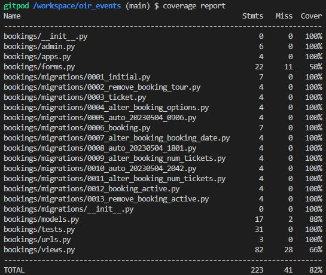

## Automated testing

Some automated tests were written to test some functionality such as views and redirects. The test cases can be found in the tests.py files with the Home, Contact, Bookings and Events apps.

Running the test suite
The tests are run in the terminal window by entering 

*     python3 manage.py test 

This will automatically run all test. If running tests in quick succession, it's recommended to add --keepdb at the end, so the database doesn't have to be rebuild for every test cycle. The test in the suite for this project all pass, but if one would fail, it would be displayed with a clear error message, so errors can be solved.

 

 

 

 

## Validator Testing

### HTML

All HTML pages were run though the [html-checker](https://validator.w3.org/nu/). 

### CSS

CSS was validated using the W3C Markup Validation Service. This was done using the 'Validate by Direct Input' option.

CSS results 

 

### JavaScript

JSHint Static Code Analysis Tool for JavaScript was used to validate the Javascript files. No significant issues were found.

JavaScript results 

 

## Testing Browser Compatibility

The website was successfully opened and rendered correctly in Chrome (both desktop and mobile versions), Edge, Firefox and Safari.

### Responsiveness
All pages were tested to ensure responsiveness on screen sizes from 320px and upwards on the following browsers and devices

### Devices
*   iPhone SE
*   OnePlus Nord
*   Dell laptop

In addition to the above listed devices, the Google Chrome Developer Tools device toggling option for all available devices was used.
