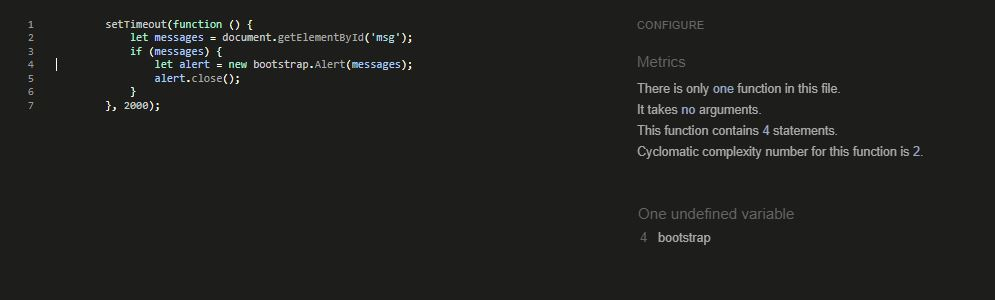

## Automated testing

Some automated tests were written to test some functionality such as views and redirects. The test cases can be found in the tests.py files with the Home, Contact, Bookings and Events apps.

Running the test suite
The tests are run in the terminal window by entering 

*     python3 manage.py test 

This will automatically run all test. If running tests in quick succession, it's recommended to add --keepdb at the end, so the database doesn't have to be rebuild for every test cycle. All tests passed, but if one failed, it would be displayed with a clear error message, so errors can be resolved.

 

 

 

 

## Validator Testing

### HTML

All HTML pages were run though the [html-checker](https://validator.w3.org/nu/). 

### CSS

CSS was validated using the W3C Markup Validation Service. This was done using the 'Validate by Direct Input' option.

CSS results

 

### JavaScript

JSHint Static Code Analysis Tool for JavaScript was used to validate the Javascript files. No significant issues were found.

JavaScript results 

 

## Testing Browser Compatibility

The website was successfully opened and rendered correctly in Chrome (both desktop and mobile versions), Edge, Firefox and Safari.

### Responsiveness
All pages were tested to ensure responsiveness on screen sizes from 320px and upwards on the following browsers and devices

### Devices
*   iPhone SE
*   OnePlus Nord
*   Dell laptop

In addition to the above listed devices, the Google Chrome Developer Tools device toggling option for all available devices was used.

### Manual Testing

1.  USER STORY: As a developer, I need to create the navbar so that users can navigate the website

**Non Logged in user**

**Step** | **Expected Result** | **Actual Result**
------------ | ------------ | ------------ |
| On any page click on the Home link in the Navigation bar  | Homepage will load| Works as expected |
| On any page click on the Events link in the Navigation bar | Events page will load| Works as expected |
| On any page click on the Contact link in the Navigation bar | Contact us page will load| Works as expected |
| On any page click on the 'Register' link in the navigation bar | Sign up page will load| Works as expected |
| On any page click on the 'Login' link in the navigation bar | Login page will load| Works as expected |
| On any page click on the 'Logo' in the navigation bar | Homepage will load| Works as expected |

**Additional features for end user logged in**

**Step** | **Expected Result** | **Actual Result**
------------ | ------------ | ------------ |
| On any page click on the Bookings link in the navigation bar, select New Booking | Booking page will load| Works as expected |
| On any page click on the Bookings link in the navigation bar, select Manage Bookins | Manage bookings page will load| Works as expected |
| On any page click on the Logout link in the navigation bar | Logout page will load| Works as expected |

**Additional features for staff logged in**

**Step** | **Expected Result** | **Actual Result**
------------ | ------------ | ------------ |
| On any page click on the Add Event link in the navigation bar | Add event page will load| Works as expected |
| On any page click on the Bookings link in the navigation bar, select Booking Overview | Booking Overview page will load| Works as expected |
| On any page click on the Bookings link in the navigation bar, select New Booking | Booking page will load| Works as expected |
| On any page click on the Bookings'link in the navigation bar, select Manage Bookins | Manage bookings page will load| Works as expected |
| On any page click on the 'Logout' link in the navigation bar | Logout page will load| Works as expected |

2.  USER STORY: As a developer I need to create the footer with social media links so this information can be found on any page on the website

**Step** | **Expected Result** | **Actual Result**
------------ | ------------ | ------------ |
| On any page, navigate to the footer, click on the Facebook icon  | Facebook opened in a new tab in users’ browser  | Works as expected |
| On any page, navigate to the footer, click on the Instagram icon | Instagram opened in a new tab in users’ browser | Works as expected |
| On any page, navigate to the footer, click on the YouTube icon   | YouTube opened in a new tab in users’ browser   | Works as expected |
| On any page, navigate to the footer, click on the Twitter icon   | Twitter opened in a new tab in users’ browser   | Works as expected |

3.  USER STORY: As a site user, I want to read frequently asked questions so that I can find information on events

**Step** | **Expected Result** | **Actual Result**
------------ | ------------ | ------------ |
| On the homepage, scroll to Visitor Information | Find Visitor Information on the homepage  | Works as expected |

4. USER STORY: As a site user, I want to access information on how to find Leinster House, so I arrive at the correct entrance

**Step** | **Expected Result** | **Actual Result**
------------ | ------------ | ------------ |
| On the homepage, scroll to Visitor Information, click on *where to find us* | Informaiton will display  | Works as expected |

5. USER STORY: As a site user, I want to be able to find information on all Oireachtas tours so that I can decide if I want to book tickets

**Step** | **Expected Result** | **Actual Result**
------------ | ------------ | ------------ |
| On any page click on the Events link in the Navigation bar | Events page will load| Works as expected |
| On any page click on the Events link in the Navigation bar, select an *event* card | Event page will load| Works as expected |
| On the homepage, in the carrousel, click on *View events* button | Events page will load| Works as expected |

6. USER STORY - As a staff member, I want to create events so I can allow bookings

**Step** | **Expected Result** | **Actual Result**
------------ | ------------ | ------------ |
| On any page click on the Add Event link in the navigation bar | Add event page will load| Works as expected |

7. USER STORY - As a staff member, I want to be able to edit events

**Step** | **Expected Result** | **Actual Result**
------------ | ------------ | ------------ |
| On any page click on the Events link in the Navigation bar, select an *event* card, select *edit* button | Event edit will load| Works as expected |
| On the homepage, in the carrousel, click on *View events* button, select an *event* card, select *edit* button | Event edit will load| Works as expected |

8. USER STORY - As a staff member, I want to be able to delete events if they are no longer going ahead or are over

**Step** | **Expected Result** | **Actual Result**
------------ | ------------ | ------------ |
| On any page click on the Events link in the Navigation bar, select an *event* card, select *delete* button | Event delete button will load| Works as expected |
| On the homepage, in the carrousel, click on *View events* button, select an *event* card, select *delete* button | Event delete button will load| Works as expected |
| Select *delete* button on Event page | Deletion confirmation page will load| Works as expected |

9. USER STORY: As a site user, I want to be able to book tickets for all available events so that I can attend

**Step** | **Expected Result** | **Actual Result**
------------ | ------------ | ------------ |
| On any page click on the Bookings link in the navigation bar, select New Booking | Booking page will load| Works as expected |
| On the homepage, in the carrousel, click on *Book now* button | Booking page will load| Works as expected |